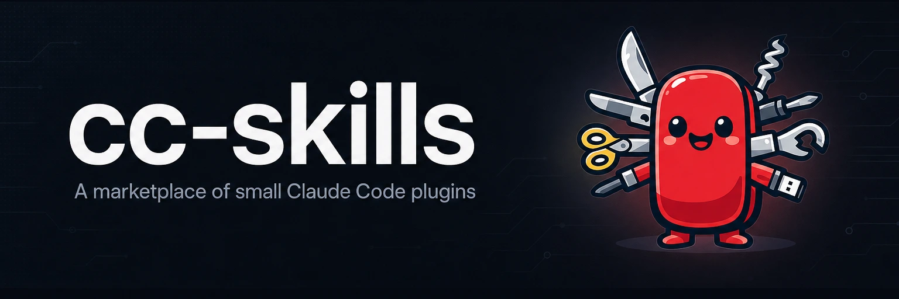

# skills



A [Claude Code](https://claude.com/claude-code) plugin marketplace of small,
focused skills. Each plugin installs independently.

## Plugins

| Plugin     | What it does                                                                 | Prerequisites |
| ---------- | ---------------------------------------------------------------------------- | ------------- |
| `slop-cop` | Check a file or text for LLM-generated prose tells and report the violations. | None; a `SessionStart` hook bootstraps its prebuilt binary. |
| `codex`    | Get a second opinion from OpenAI's Codex CLI on hard debugging or design problems, or generate images with its `$imagegen` skill. | The `codex` CLI on `PATH`. |
| `repo-bootstrap` | Scaffold a new repo with proven conventions: agent docs, Claude Code settings, guard hooks, plus an opinionated Python packaging layer. | `uv` (for the hooks and the Python layer); `gh` recommended; `gen-image` for brand images. |
| `llm-prompts` | Guidance for writing effective LLM prompts and agent instructions, refreshed with current per-provider model behaviors. | None; `slop-cop` recommended for the post-edit prose check. |
| `writing-docs` | Write docs in Diataxis modes with a technical-builder voice, runnable code-sample rules, and a slop-cop prose pass. | None; `slop-cop` recommended for the prose pass. |
| `gen-image` | Generate project images — mascot logos, README banners (dark/light), social cards, illustrations — compressed locally to under 1 MiB. | `uv`; an `OPENAI_API_KEY` (the `codex` plugin's `$imagegen` is the no-key fallback). |
| `gh-profile` | Create or refresh a fancy GitHub profile README from your real repos and activity, with cron Actions that keep it fresh and an opt-in daily Claude refresh that summarizes recent commits and releases. | `gh` authenticated with `repo` + `workflow` scopes; `gen-image` for the banner; `repo-summaries` for the daily Claude refresh. |
| `repo-summaries` | Maintain a Claude-written summaries sidecar in any repo: a committed read-side module plus a config-driven daily refresh skill that turns real commit and release data into one-line suffixes. | `gh` for the raw-material recipes. |
| `cli-demo` | Generate an animated SVG terminal demo of a CLI with `evp`: write a `.tape`, render it, inspect the keyframes, and refine in a loop. | Docker (`linux/amd64`) on macOS/ARM; native on Linux x86_64. A `SessionStart` hook bootstraps the `evp` binary. |
| `agent-browser-with-cookies` | Run authenticated `agent-browser` sessions by reusing your local browser login: extract a site's cookies and seed them into a fresh session. | macOS; `uv`; the `agent-browser` skill. Chrome self-decrypt needs a one-time _Always Allow_ plus a Touch ID tap (cross-browser `@mherod/get-cookie` fallback). |

## Install

Add the marketplace, then install the plugins you want:

```
/plugin marketplace add yasyf/cc-skills
/plugin install slop-cop@skills
/plugin install codex@skills
/plugin install repo-bootstrap@skills
```

To try it from a local checkout before publishing:

```
/plugin marketplace add ~/Code/cc-skills
```

## slop-cop

Wraps the [`slop-cop`](https://github.com/yasyf/slop-cop) CLI. Ask the agent to
"check this file for slop" (or name a path) and it runs `slop-cop check`,
auto-detecting the input language and masking non-prose regions, then reports
the violations grouped by category. It only rewrites the file if you ask. A
`SessionStart` hook fetches the host-matched binary from the latest
`yasyf/slop-cop` release into the plugin's persistent data dir, so no Go
toolchain is needed and there is no first-call download stall.

## codex

A second-opinion escape hatch for when you're stuck after a couple of failed
attempts. The skill gathers full context, hands it to `codex exec`, and returns
a structured summary you can verify. It also covers image generation through
Codex's built-in `$imagegen` skill — logos, mascots, banners, illustrations —
including the chroma-key workaround for transparent backgrounds. It needs the
OpenAI Codex CLI installed and authenticated on your machine.

## repo-bootstrap

Scaffolds a new repo with conventions that work out of the box, so you skip the
first day of setup. Every repo gets a base layer: agent docs
(AGENTS.md/CLAUDE.md/STYLEGUIDE.md), a README skeleton, a generated mascot logo
and README banner (via the `gen-image` plugin), Claude Code settings,
[semble](https://pypi.org/project/semble/) code search, and
[capt-hook](https://github.com/yasyf/captain-hook) guard hooks. Python projects
also get an opinionated packaging layer: uv with the `uv_build` backend, a Click
CLI, loguru, pytest, ruff, ty type-checking, plus two opt-in features — [Great
Docs](https://posit-dev.github.io/great-docs/) published to GitHub Pages and
tag-driven PyPI releases via trusted publishing. Say "bootstrap a new repo" or
"scaffold a new Python package".

## llm-prompts

Packages the team's prompt-writing guidance as a skill: positive framing,
contrastive examples, XML tag structure, reasoning-first output, and the current
per-provider knobs (effort/verbosity/thinking) for Claude, GPT-5.x, and Gemini.
Deeper per-provider notes live under its `reference/` folder. `repo-bootstrap`
installs a companion capt-hook nudge that points prompt edits back at this skill.

## writing-docs

Turns any documentation task — README, tutorial, how-to, reference page,
changelog — into a checklist-driven process: pick one Diataxis mode per page,
write narrative prose in a technical-builder voice (first-person, confident,
hands-on), keep every code sample runnable, and finish with a triaged
`slop-cop` pass. `repo-bootstrap` enables it in scaffolded repos and applies it
when filling in README and docs-site prose at bootstrap time.

## gen-image

The marketplace's shared image generator. One CLI covers the raw primitive
("generate this prompt at this size") and three presets: a transparent mascot
logo, a wide README banner in dark and light variants, and the full brand
pipeline (logo, banner, GitHub social card) that `repo-bootstrap` uses. Every
output is lossy-compressed locally to under 1 MiB — quantized PNG for logos,
WebP for banners, JPEG for social cards. Ask for "a logo for this project" or
"a dark/light README banner", or let `repo-bootstrap` and `gh-profile` call it
for you. Needs an `OPENAI_API_KEY`; without one it falls back to the `codex`
plugin's `$imagegen`.

## gh-profile

Builds the special `<username>/<username>` repo whose README renders on your
GitHub profile page. It harvests your real repos, stars, languages, pinned
projects, releases, and recent activity into a dossier, interviews you briefly
for voice (tagline, current focus, fun facts), then composes an opinionated
README: AI banner, flagship projects, categorized project lists, a
recently-shipped feed, a skill-icon grid, and a snake contribution animation.
A small updater script committed into the repo re-renders the data sections on
a cron Action — no Claude required — and a flattery gate hides any stat that
doesn't impress (low star counts never show). An opt-in daily Claude workflow
installs this plugin fresh from the marketplace and runs its `refresh` skill,
summarizing your recent commits and releases into the activity and shipped
lines ("Pushed to cc-review — built the realtime inline-comment web UI").
Updates are non-destructive: only marker-delimited sections are regenerated,
hand-written prose is never touched. The summaries machinery comes from the
`repo-summaries` plugin — gh-profile is its reference consumer. Say "make my
GitHub profile fancy" or "refresh my profile README".

## repo-summaries

The sidecar pattern behind gh-profile's summary lines, packaged for any repo
with a rendered surface that wants Claude-written one-liners. Consumers commit
two things: the plugin's stdlib-only `summaries.py` module (their render
script reads the sidecar through it — whole-file staleness gate, sanitizing,
key matching, so a dead Claude workflow degrades lines to plain instead of
lying) and a `.github/summaries.config.json` describing their groups, keys,
raw-material recipes, and render command. The `/repo-summaries:refresh` skill
then runs headless on a schedule: it gathers real commit and release data per
the config, rewrites the sidecar whole (unchanged entries are reused verbatim,
vanished keys are pruned), and re-renders. A strict flattery law governs every
summary: each word traces to commit subjects, PR titles, or release content,
and uninformative material gets no entry at all.

## cli-demo

Drives [`evp`](https://github.com/HalFrgrd/evp) to record a CLI in action as an
animated SVG. You write a `.tape` script, render it, look at the still keyframes, and
refine — it is a loop, not a one-shot, and most demos take a few passes. evp ships only
a Linux x86_64 binary, so on macOS/ARM the render runs inside a `linux/amd64` Docker
container (handled for you by `evp-run.sh`); on a native Linux x86_64 host it runs
against the host PATH directly. Because evp executes the demoed command in its own
embedded shell, the CLI has to be reachable in that render environment — present on the
host PATH, or installed into the container. A `SessionStart` hook pre-fetches the `evp`
binary into the plugin's persistent data dir, so there is no first-call download stall.
Say "record a terminal demo of `<cli>`" or ask for a demo SVG/GIF for a README.

## agent-browser-with-cookies

Runs authenticated `agent-browser` tasks without re-logging-in or disturbing your
running browser. It pulls the cookies for one site out of your local cookie store and
seeds them into an isolated `agent-browser` session, then hands off to the normal
`agent-browser` skill for the task itself. The primary path self-decrypts Chrome through
Apple's signed `/usr/bin/security`, gated by a Touch ID tap — the first run also needs a
one-time "Always Allow" you click yourself. If Chrome holds no cookies for the site, a
`@mherod/get-cookie` fallback sweeps your other browsers (Brave, Arc, Edge, Safari,
Firefox). The state file is deleted the moment the session picks the cookies up, so they
live only in the browser context, never on disk. macOS only. Reach for it when a browser
task needs you signed in — "do X on `<site>` as me", "use my session/cookies".

## License

MIT. See [LICENSE](LICENSE).
